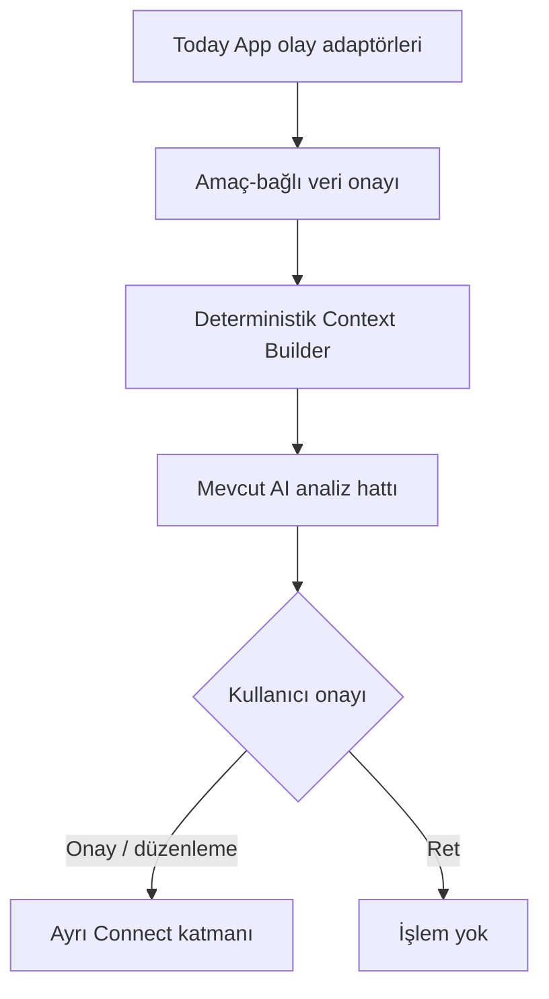

# Ürün ve Sistem Mimarisi

## Amaç

Today AI Engine; Core, Health ve Sky bağlamından sınırlı veri alarak açıklanabilir analiz ve işlem taslağı üretir. Today App'in ekranlarını, kayıt sistemini veya modül merkezini yeniden oluşturmaz.

## Mevcut durum

Salt okunur Today App NUT-016.6 kaynak ve paket incelemesinde App `2.9.0`, store schema `2`, çevrimdışı kabuk `today-v2-foundation-058` ve referans regresyon raporu `822 PASS / 0 FAIL` olarak doğrulandı. Core, Health ve Sky gerçek veri üretir. Ayrıntılı eşleme `APP_CONTRACT_MAPPING.md` içindedir.

Bu referans eşlemenin host entegrasyonu NUT-017.2 ile Today App `2.10.0` ve `today-v2-foundation-059` üzerinde uygulanmıştır. App adaptörleri yalnız public API'leri çağırır; Context Builder ve onay değerlendiricisi değişmeden kalır. Ayarlar yüzeyi yalnız bağlam önizlemesi üretir, analiz sağlayıcısı kaydetmez ve Connect işlemi başlatmaz.

NUT-017.3 ile App `2.11.0` ve `today-v2-foundation-060` üzerinde, onaylı bağlam önizlemesinden sonra ayrı kullanıcı komutuyla çalışan ilk açıklanabilir analiz eklenmiştir. Bu çalışma canlı/yerel model sağlayıcısı kaydetmez; mevcut foundation policy guard, explanation builder, approval gateway veya audit writer bileşenlerini yeniden oluşturmaz. Yeni saf analizör yalnız belgelenmiş ilk deterministik kuralı uygular ve mevcut `analysis-output` v1 sözleşmesini üretir.

## Sınırlar

### Bileşenler

1. Contract boundary: Girdi ve çıktıları JSON Schema ile doğrular.
2. Consent evaluator: Amaç, zaman, kaynak, veri sınıfı, serbest metin ve cihaz-içi işleme sınırını fail-closed doğrular.
3. Context Builder: App'in ürettiği olay zarflarından yalnızca onaylı alanları seçer; provenance, omission ve redaction kayıtları üretir.
4. Policy guard: Sağlık, ruh sağlığı, finans, hukuk ve astroloji risk sınırlarını uygular.
5. Analysis adapter: İlk aşamada deterministik kural motoru; ileride yerel/bulut model adaptörü.
6. Explanation builder: Öneri, dayanak, güven ve belirsizlik üretir.
7. Approval gateway: Önerilen eylemleri `pending-user-approval` durumunda tutar.
8. Audit event writer: Karar ve eylem durumlarını izlenebilir olaylar olarak üretir; App ana verisini doğrudan yazmaz.

## Entegrasyon etkisi

App yalnızca sözleşme nesnelerini üretir ve AI çıktısını ilgili görünür modül içinde sunar. Engine, DOM seçicisi, CSS sınıfı, `localStorage` anahtarı veya App navigasyonu bilmez. Context Builder saf bir fonksiyondur; zamanını bile `requestedAt` alanından alır. Connect adaptörü Engine'den ayrı kalır.

## NUT-017.1 çalışma zamanı sınırı

`buildTodayContext(request)` yalnız verilen nesneyi işler ve `{ ok, context | error }` döndürür. Onay geçersizse hiç paket üretmez. Geçerli pakette Core, Health ve `symbolicContext` fiziksel olarak ayrı bölümlerdir. Bu paket bir AI çıktısı değildir; analiz hattına güvenli girdidir.

## NUT-017.2 host sınırı

Today App'teki kaynak adaptörü Core için `TodayStorage`, Health için `TodayHealthHub` ve `TodayNutritionStorage`, sembolik Sky için yalnız `TodayCoreSkyLink` public API'lerini kullanır. DOM sahipliği ayrı UI modülündedir; Engine köprüsü DOM, App depolaması ve ağ bilmez. Onay bellekte tek istek için yaşar ve kapsam değiştiğinde düşürülür.

## NUT-017.3 analiz sınırı

`analyzeTodayContext(request)` yalnız `analysis-request` v1 nesnesini işler. Context Package cihaz-içi/istek-süreli sınırları, açık onay fişi, provenance ve ayrı sembolik Sky bölümüyle doğrulanır. İlk kural yalnız aynı yerel gündeki en güncel Core `C` kaydı ile 6 saatin altındaki en güncel uyku kaydını kullanır. Başarılı çıktı iki gerçek olay kimliğini dayanak gösterir; eşleşme yoksa fail-closed sonuç döner.

App köprüsü analiz sonucunu değiştirmez, sağlayıcı kaydetmez ve Connect çağırmaz. UI sonucu yalnız ayrı kullanıcı komutundan sonra gösterir. İşlem taslağı `pending-user-approval` kalır; NUT-017.3 onay kararı toplamaz, audit olayı yazmaz ve eylemi yürütmez. Sky seçilmiş olsa bile dayanak, confidence veya sağlık/duygu yorumuna katılmaz.

## Riskler

- Health Hub'ın sürümsüz yerel kayıtları App adaptöründe formal olaylara çevrilmezse çift veri modeli oluşabilir.
- Serbest metin notları gereğinden fazla kişisel veri taşıyabilir; varsayılan özetleme/çıkarma gerekir.
- Güven puanı gerçek olasılık gibi algılanabilir; puanın anlamı ürün metninde açıklanmalıdır.
- Sky verisi sağlık önerisinin kanıtı yapılamaz.
