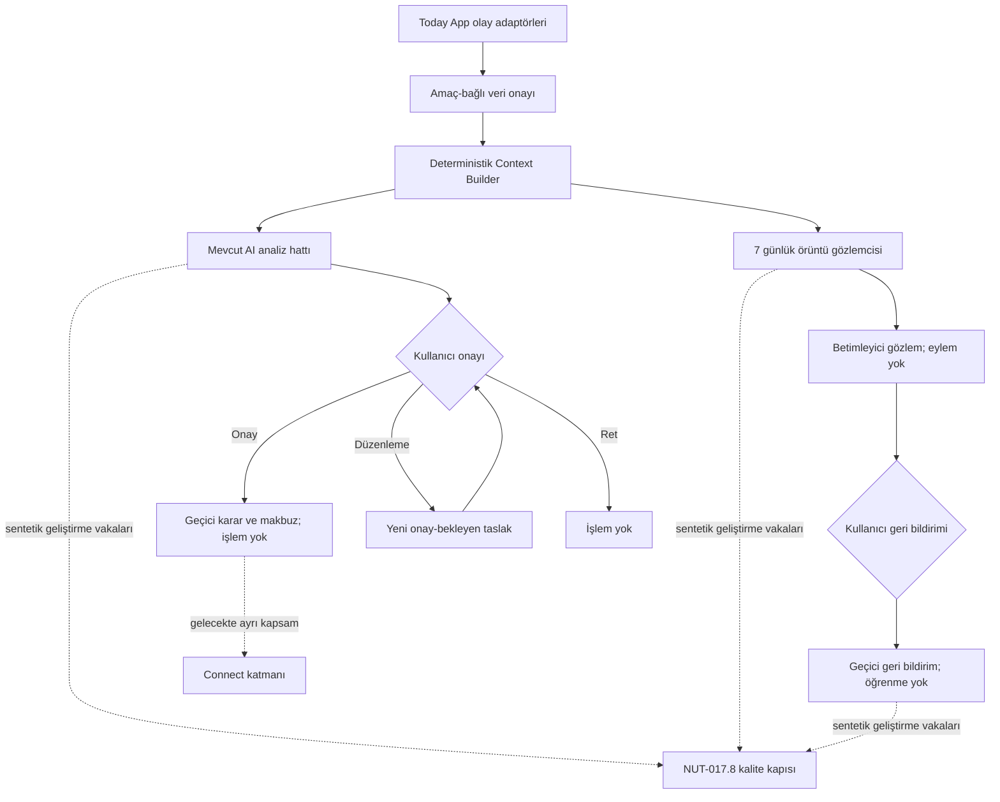

# Ürün ve Sistem Mimarisi

## Amaç

Today AI Engine; Core, Health ve Sky bağlamından sınırlı veri alarak açıklanabilir analiz ve işlem taslağı üretir. Today App'in ekranlarını, kayıt sistemini veya modül merkezini yeniden oluşturmaz.

## Mevcut durum

Salt okunur Today App NUT-016.6 kaynak ve paket incelemesinde App `2.9.0`, store schema `2`, çevrimdışı kabuk `today-v2-foundation-058` ve referans regresyon raporu `822 PASS / 0 FAIL` olarak doğrulandı. Core, Health ve Sky gerçek veri üretir. Ayrıntılı eşleme `APP_CONTRACT_MAPPING.md` içindedir.

Bu referans eşlemenin host entegrasyonu NUT-017.2 ile Today App `2.10.0` ve `today-v2-foundation-059` üzerinde uygulanmıştır. App adaptörleri yalnız public API'leri çağırır; Context Builder ve onay değerlendiricisi değişmeden kalır. Ayarlar yüzeyi yalnız bağlam önizlemesi üretir, analiz sağlayıcısı kaydetmez ve Connect işlemi başlatmaz.

NUT-017.3 ile App `2.11.0` ve `today-v2-foundation-060` üzerinde, onaylı bağlam önizlemesinden sonra ayrı kullanıcı komutuyla çalışan ilk açıklanabilir analiz eklenmiştir. Bu çalışma canlı/yerel model sağlayıcısı kaydetmez; mevcut foundation policy guard, explanation builder, approval gateway veya audit writer bileşenlerini yeniden oluşturmaz. Yeni saf analizör yalnız belgelenmiş ilk deterministik kuralı uygular ve mevcut `analysis-output` v1 sözleşmesini üretir.

NUT-017.3.1 ile App `2.11.1`, Engine `0.3.1-analysis` ve `today-v2-foundation-061` üzerinde eşleşmeme tanısı eklenmiştir. İlk kuralın koşulları değişmez. Yalnız doğrulanmış Context Package içindeki en güncel Core ve uyku gözlemleri ile aynı yerel tarih denetimi App köprüsüne gerekçeli olarak döner. Geçersiz isteğe tanı üretilmez; Sky tanıya katılmaz.

NUT-017.3.2 ile App `2.11.2` ve `today-v2-foundation-062` üzerinde yalnız host kaynak seçimi düzeltilmiştir. Kaynak başına sınır dolduğunda en eski olaylar yerine en yeni deterministik alt küme korunur; Engine `0.3.1-analysis`, sözleşmeler ve ilk kural değişmez. Böylece yeni uyku kaydı eski Health olaylarınca bağlam dışında bırakılamaz.

NUT-017.4 ile App `2.12.0`, karar katmanı `0.4.0-approval` ve `today-v2-foundation-063` üzerinde mevcut `approval-decision` v1 sözleşmesine bağlı geçici kullanıcı kararı eklenmiştir. Onay ve ret eylem yürütmez. Düzenleme yeni bir onay-bekleyen taslak üretir. Karar bellekte yalnız bu istek için tutulur; Connect ve kalıcı audit yazımı kapalıdır.

NUT-017.5 ile App `2.13.0`, karar makbuzu katmanı `0.5.0-receipt` ve `today-v2-foundation-064` üzerinde geçerli karar sonucunu sürümlü, istek-süreli bir makbuza dönüştürür. Makbuz iç sözleşmede karar–analiz–işlem taslağı bağını korur; App yalnız sade sonucu gösterir. Geçmiş yeni önizlemede veya sayfa yenilendiğinde sıfırlanır. Storage, Connect, gerçek işlem, dış aktarım ve kalıcı audit hâlâ kapalıdır.

NUT-017.6 ile App `2.14.0`, örüntü gözlem katmanı `0.6.0-pattern` ve `today-v2-foundation-065` üzerinde aynı onaylı Context Package'ten ayrı bir yedi günlük tekrar gözlemi eklenmiştir. En az üç aynı-gün Core/uyku çifti ve iki Core `C` + 6 saat altı uyku birlikteliği yoksa gözlem üretilmez. Çıktı nedensellik, teşhis, Sky dayanağı, onay veya eylem taşımaz; kullanıcıya teknik kimlikler olmadan sade bir kart olarak gösterilir.

NUT-017.7 ile App `2.15.0`, geri bildirim katmanı `0.7.0-feedback` ve `today-v2-foundation-066` üzerinde kullanıcının başarılı örüntü gözlemini doğrulayabilmesi eklenmiştir. Üç açık yanıt geçerli gözleme bağlanır ve yalnız mevcut istek boyunca tutulur. Geri bildirim gözlemi veya güveni değiştirmez; öğrenme, kalıcı hafıza, Sky kullanımı, Connect ve işlem kapalı kalır.

NUT-017.8 ile Engine `0.8.0-evaluation` üzerinde günlük analiz, yedi günlük gözlem ve kullanıcı geri bildirimi için 12 vakalık sentetik benchmark eklenmiştir. Bu geliştirme kapısı gerçek kullanıcı verisi veya çalışma zamanı UI'sı kullanmaz. Sonuç; vaka beklentileri ve güvenlik kontrolleridir, AI doğruluk olasılığı değildir. Today App çalışma tabanı `2.15.0`, schema `2` ve `today-v2-foundation-066` olarak değişmeden kalır.

## Sınırlar

### Bileşenler

1. Contract boundary: Girdi ve çıktıları JSON Schema ile doğrular.
2. Consent evaluator: Amaç, zaman, kaynak, veri sınıfı, serbest metin ve cihaz-içi işleme sınırını fail-closed doğrular.
3. Context Builder: App'in ürettiği olay zarflarından yalnızca onaylı alanları seçer; provenance, omission ve redaction kayıtları üretir.
4. Policy guard: Sağlık, ruh sağlığı, finans, hukuk ve astroloji risk sınırlarını uygular.
5. Analysis adapter: İlk aşamada deterministik kural motoru; ileride yerel/bulut model adaptörü.
6. Explanation builder: Öneri, dayanak, güven ve belirsizlik üretir.
7. Pattern observer: NUT-017.6 son 7 günlük aynı-gün Core/uyku tekrarını betimler; nedensellik, teşhis veya eylem üretmez.
8. Pattern feedback processor: NUT-017.7 kullanıcının üç açık yanıtından sürümlü, istek-süreli bir makbuz üretir; gözlemi veya modeli değiştirmez.
9. Synthetic benchmark evaluator: NUT-017.8 yalnız sürümlü sentetik vaka paketini çalıştırır; açıklanabilirlik ve güvenlik beklentilerini raporlar, çalışma zamanı kullanıcı verisine bağlanmaz.
10. Approval gateway: Foundation sınırı ve mevcut sözleşme korunur; NUT-017.4 işlemcisi onay/ret/düzenleme kararını yalnız istek kapsamında değerlendirir.
11. Decision receipt builder: NUT-017.5 geçerli karar sonucundan sürümlü ve istek-süreli bir olay üretir; olayı yazmaz veya saklamaz.
12. Audit event writer: Foundation mimari sınırı olarak korunur; NUT-017.8 tarafından çağrılmaz ve kalıcı audit henüz uygulanmaz.

## Entegrasyon etkisi

App yalnızca sözleşme nesnelerini üretir ve AI çıktısını ilgili görünür modül içinde sunar. Engine, DOM seçicisi, CSS sınıfı, `localStorage` anahtarı veya App navigasyonu bilmez. Context Builder saf bir fonksiyondur; zamanını bile `requestedAt` alanından alır. Connect adaptörü Engine'den ayrı kalır.

## NUT-017.1 çalışma zamanı sınırı

`buildTodayContext(request)` yalnız verilen nesneyi işler ve `{ ok, context | error }` döndürür. Onay geçersizse hiç paket üretmez. Geçerli pakette Core, Health ve `symbolicContext` fiziksel olarak ayrı bölümlerdir. Bu paket bir AI çıktısı değildir; analiz hattına güvenli girdidir.

## NUT-017.2 host sınırı

Today App'teki kaynak adaptörü Core için `TodayStorage`, Health için `TodayHealthHub` ve `TodayNutritionStorage`, sembolik Sky için yalnız `TodayCoreSkyLink` public API'lerini kullanır. DOM sahipliği ayrı UI modülündedir; Engine köprüsü DOM, App depolaması ve ağ bilmez. Onay bellekte tek istek için yaşar ve kapsam değiştiğinde düşürülür.

## NUT-017.3 analiz sınırı

`analyzeTodayContext(request)` yalnız `analysis-request` v1 nesnesini işler. Context Package cihaz-içi/istek-süreli sınırları, açık onay fişi, provenance ve ayrı sembolik Sky bölümüyle doğrulanır. İlk kural yalnız aynı yerel gündeki en güncel Core `C` kaydı ile 6 saatin altındaki en güncel uyku kaydını kullanır. Başarılı çıktı iki gerçek olay kimliğini dayanak gösterir; eşleşme yoksa fail-closed sonuç döner.

App köprüsü analiz sonucunu değiştirmez, sağlayıcı kaydetmez ve Connect çağırmaz. UI sonucu yalnız ayrı kullanıcı komutundan sonra gösterir. İşlem taslağı `pending-user-approval` kalır; NUT-017.3 onay kararı toplamaz, audit olayı yazmaz ve eylemi yürütmez. Sky seçilmiş olsa bile dayanak, confidence veya sağlık/duygu yorumuna katılmaz.

### NUT-017.3.1 eşleşmeme tanısı

`no-matching-rule`, öneri yerine `ruleEvaluation` ayrıntısı taşıyabilir. Bu ayrıntı yalnız kuralın sabit gereksinimlerini, seçilen Core/uyku olay kimliklerini, yerel tarihleri, izinli seçim/süre değerlerini, üç boolean denetimi ve kontrollü gerekçe kodlarını içerir. App UI tanıyı kullanıcı diline çevirir; Engine hâlâ DOM, depolama veya ağ bilmez.

### NUT-017.3.2 host kayıt seçimi

Today App adaptörü, onaylı her kaynak için olay sınırını Engine çağrısından önce uygular. Sınır aşıldığında en yeni alt küme seçilir ve dış sözleşmeye verilmeden önce tekrar kronolojik sıraya konur. Bu seçim saf, cihaz-içi ve deterministiktir. Engine bu mantığı, App depolama anahtarlarını veya DOM'u bilmez.

## NUT-017.4 karar sınırı

`processApprovalDecision(request)` yalnız mevcut `approval-decision` v1 alanlarını ve onay bekleyen eylem taslağını kabul eder. Onay `approved`, ret `rejected` geçici durumu üretir. Düzenleme yalnız hatırlatma saatini değiştirir, yeni bir `pending-user-approval` taslağı verir ve otomatik onay sayılmaz.

App'teki `ai-approval-bridge.mjs` karar sonucunu değiştirmez ve DOM, depolama, ağ, Connect veya audit yazarı bilmez. DOM sahipliği `ai-context-ui.mjs` içinde kalır. Teknik olay kimlikleri ve kural kodları Engine içinde izlenebilirlik için korunurken kullanıcı yüzeyine çıkarılmaz. Kullanıcı dayanakları, anlaşılır güven düzeyini, belirsizlikleri, seçenekleri ve karar durumunu görür.

Bu adım bir gerçek eylem gateway'i değildir: `executionRequested=false`, `auditPersisted=false`, `externalTransfer=false` sabittir. Onaylanan hatırlatıcıyı yürütmek gelecekte ayrı Connect kapsamı ve yeni açık işlem onayı gerektirir.

## NUT-017.5 karar makbuzu sınırı

`buildDecisionReceipt(request)`, yalnız NUT-017.4 işlemcisinin doğrulanmış karar sonucunu kabul eder. Karar, analiz ve işlem taslağı kimlikleri ile durumlarının tutarlılığını denetler; sonuçtan `decision-receipt` v1 üretir. Düzenleme varsa yeni taslak kimliği bağlanır ve yeniden onay gereksinimi açık tutulur.

Makbuzun kapsamı değiştirilemez: `device-only`, `request-scoped`, `persistent=false` ve `externalRecipient=null`. İşlem yürütme, Connect, kalıcı audit ve dış aktarım etkileri `false` kalır. App köprüsü makbuzu yalnız aynı ekran isteğinin belleğinde UI'ya iletir; yeni önizleme, temizleme veya sayfa yenileme geçmişi düşürür.

## NUT-017.6 örüntü gözlem sınırı

`observeTodayPattern(request)` yalnız `pattern-observation-request` v1 ve tam yedi günlük Context Package kabul eder. Her yerel tarihte en güncel `daily-checkin` ve `sleep-record` seçilir. Geçerli seçim/süre taşıyan en az üç aynı-gün çiftinden en az ikisi Core `C` ve 360 dakikanın altında uyku içeriyorsa `pattern-observation-output` v1 üretilir.

Çıktının dayanakları yalnız eşleşen Core ve Health olaylarına bağlanır. Güven puanı pencere kapsamı ile tekrar oranından hesaplanır; olasılık değildir ve UI'da sade düzeye çevrilir. Sky Context Package'te bulunabilir fakat seçim, dayanak, güven veya tanıya katılmaz. Gözlem `approval.required=false` ve `actionProposed=false` taşır; App belleği dışında saklanmaz.

## NUT-017.7 örüntü geri bildirimi sınırı

`processPatternFeedback(request)` yalnız sözleşmeye uygun, eylemsiz ve nedenselliksiz `pattern-observation-output` v1 ile `resonates`, `does-not-resonate` veya `unsure` yanıtlarından birini kabul eder. Gözlemin güven, onay, Sky, işlem veya kalıcılık sınırı değiştirilmişse istek fail-closed reddedilir.

Başarılı sonuç `pattern-feedback-receipt` v1 üretir ve kullanıcı yanıtını gerçek gözlem kimliğine bağlar. Makbuz yalnız cihazda ve mevcut istek boyunca yaşar. Gözlem ve güven değişikliği, model öğrenmesi, hafıza yazımı, eylem, Connect, kalıcı audit ve dış aktarım etkilerinin tamamı `false` kalır. App köprüsü DOM veya depolama bilmez; UI yalnız üç sade seçenek ile son seçimi gösterir ve teknik kimlikleri gizler.

## NUT-017.8 sentetik değerlendirme sınırı

`evaluateSyntheticBenchmark(suite)` yalnız `benchmark-suite` v1 ve `synthetic-*` kimlikli, serbest metinsiz dar olaylar kabul eder. Günlük analiz, örüntü gözlemi ve geri bildirim işlemcilerini gerçek App kayıtları olmadan çalıştırır. Beklenen başarı, kontrollü sonuçsuzluk ve fail-closed ret davranışlarını; açıklama alanlarını; dayanak bağlarını; onay/dış etki sınırlarını ve Sky eklendiğinde örüntü sonucunun değişmemesini denetler.

`benchmark-report` v1 ham olayı veya AI çıktısını kopyalamaz; yalnız vaka kimlikleri, beklenen/gerçek sonuçlar ve kontrol durumlarını taşır. `accuracyClaim=false`, `realUserDataUsed=false`, `modelProviderUsed=false`, `modelUpdated=false`, `connectCalled=false`, `auditPersisted=false` ve `externalTransfer=false` sabittir. Değerlendirici App kabuğuna veya kullanıcı arayüzüne yüklenmez; yalnız test/geliştirme komutuyla çalışır.

## Riskler

- Health Hub'ın sürümsüz yerel kayıtları App adaptöründe formal olaylara çevrilmezse çift veri modeli oluşabilir.
- Serbest metin notları gereğinden fazla kişisel veri taşıyabilir; varsayılan özetleme/çıkarma gerekir.
- Güven puanı gerçek olasılık gibi algılanabilir; sayısal değer iç sözleşmede korunmalı, kullanıcıya anlaşılır düzey ve kesinlik uyarısıyla sunulmalıdır.
- Sky verisi sağlık önerisinin kanıtı yapılamaz.
